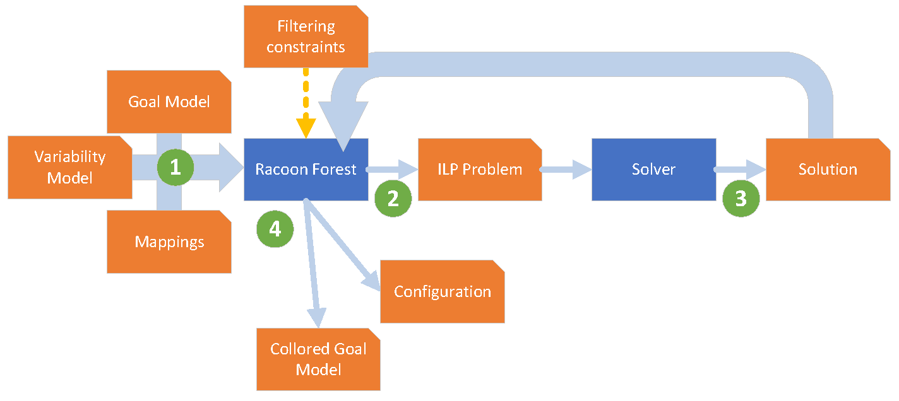

Raccoon Forest is a tool that serves as a translator between variability and goal models and optimization scripts. It can transform the results of an optimization process in specific SPL products and a goal model labeled with the satisfaction level of each intentional element. An overview of the Raccoon Forest work can be seen in the following figure.

 

This repository is a working Eclipse Project. To start working with Raccoon Forest, import it into your workspace. You can find examples of use of the classes in the package iav.caosd.uma. The current version of the tool supports goal models created in the piStar tool (https://www.cin.ufpe.br/~jhcp/pistar/), variability models in the UVL standard for variability modeling (https://universal-variability-language.github.io/), and scripts in MATLAB using intlinprog (https://es.mathworks.com/help/optim/ug/intlinprog.html). 

