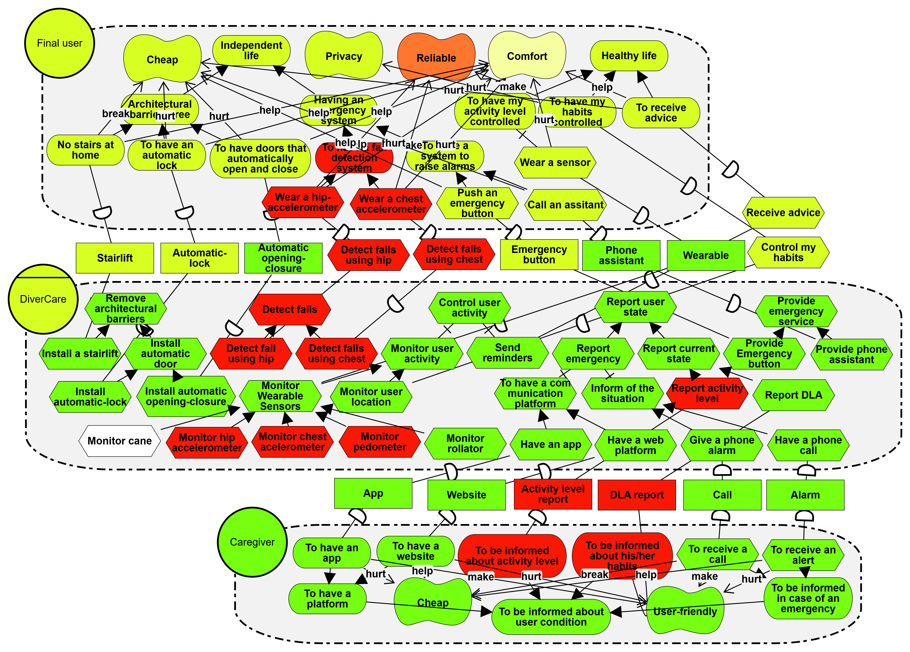

Raccoon Forest is a command-line tool that takes goal models, VMs, and the mappings between them as inputs and transforms them into linear constraints. Additionally, it constructs various objective functions using information from the goal model. The tool generates a script that enables end users to solve the problem with an external solver, which then produces a solution.
Finally, Raccoon Forest processes the solver's results to present the satisfaction levels of the goal model’s intentional elements and the corresponding VM configuration. Details of the Raccoon Forest optimization process can be found in the paper [Analysis and optimisation of SPL products using goal models](https://ieeexplore.ieee.org/abstract/document/10260981). An overview of the Raccoon Forest work is shown in the following figure. 
 

This repository is a working Eclipse Project. To start working with Raccoon Forest, import it into your workspace. You can find examples of use of the classes in the package iav.caosd.uma. The current version of the tool supports goal models created in the piStar tool (https://www.cin.ufpe.br/~jhcp/pistar/), variability models in the UVL standard for variability modeling (https://universal-variability-language.github.io/), and MATLAB scripts using intlinprog (https://es.mathworks.com/help/optim/ug/intlinprog.html). Use the piStar tool to visualize goal models; UVL files can be viewed in any text editor. The next figure shows an example of a colored goal model. We use green for an intentional element with a satisfaction level of 100, white for 50, and red for 0. The intermediate cases have different shades of orange (values between 0 and 50) and yellow (values between 50 and 100), with lighter shades corresponding to higher values and darker shades to lower values. 

In this repository, you can find some of the examples that we have developed to validate Raccoon Forest, DiverCare is one of them. This illustrative example is composed of a goal model ([divercar-gm.txt](https://github.com/iayalavinas/RaccoonForestGit/blob/main/divercare-gm.txt)), a variability model ([divercare.uvl](https://github.com/iayalavinas/RaccoonForestGit/blob/main/divercare.uvl)) and the mapping between them ([divercareMap.mf](https://github.com/iayalavinas/RaccoonForestGit/blob/main/divercareMap.mf)). The generated script is [allAgents.m](https://github.com/iayalavinas/RaccoonForestGit/blob/main/allAgents.m), and the solution vector resultant from the execution of this script in Matlab is [allAgents-res.txt](https://github.com/iayalavinas/RaccoonForestGit/blob/main/allAgents-res.txt). As shown in the figure, this file is transformed by Raccoon Forest to generate the configuration of the variability model ([divercare-conf.json](https://github.com/iayalavinas/RaccoonForestGit/blob/main/divercare-conf.json)) and a colored goal model that shows the satisfaction level of each intentional element ([collored-divercare-gm.txt](https://github.com/iayalavinas/RaccoonForestGit/blob/main/collored-divercare-gm.txt)).

As part of the validation of Raccoon Forest, we have conducted experiments to measure execution times and analyze the scalability of different components of the framework. Specifically, we have analyzed the generation of scripts, their execution, and the transformation of script output in a product configuration and a colored goal model. We have three datasets in the folders *validity*, *cdl*, and "busy". The *validity* folder contains small problems with variability models that have between  $5*10^3$ and $4*10^6$ number of possible configurations, the *cdl* folder contains medium size problems with variability models having between $7*10^{130}$ and $1*10^{186}$ possible configurations and, finally, the *busy* folder contain large problems with variability models with a number of possible configurations between $3*10^{210}$ and $3*10^{226}$. Experiments need a goal model, a variability model, and a mapping file. To facilitate grouping these three elements, we have assigned them the same letter or number, with additional wording to distinguish the model type. Java classes [ScriptGenerationExperiments.java](https://github.com/iayalavinas/RaccoonForestGit/blob/main/src/iav/caosd/uma/ScriptGenerationExperiments.java) and [SolutionGenerationExperiments.java](https://github.com/iayalavinas/RaccoonForestGit/blob/main/src/iav/caosd/uma/SolutionGenerationExperiments.java) must be modified to take the appropriate files to run experiments to measure script generation and solution generation. The time to run scripts should be measured in MATLAB by running the specific script.

The variability models used in the experiments are from [uvlhub.io](https://www.uvlhub.io/). Goal models were generated by ChatGPT using the guidelines provided in the paper [Towards Automatic Generation of iStar Models Using ChatGPT](https://ceur-ws.org/Vol-3936/iStar24_paper_3.pdf). The specific prompts can be found in the folder *prompts*.
