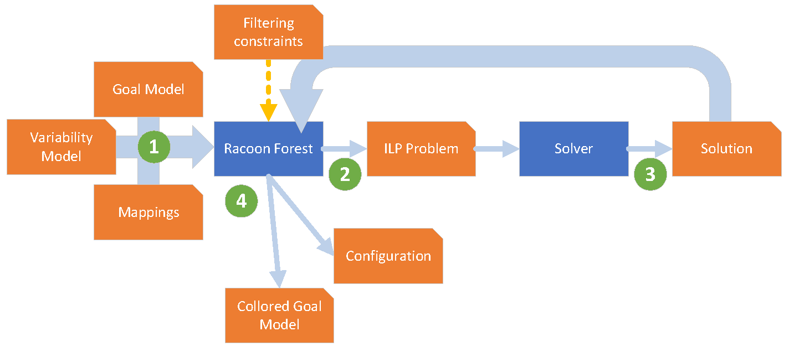

Raccoon Forest is a tool that serves as a translator between variability and goal models and optimization scripts. It can transform the results of an optimization process in specific SPL products and a goal model labeled with the satisfaction level of each intentional element. An overview of the Raccoon Forest work is shown in the following figure.

 

This repository is a working Eclipse Project. To start working with Raccoon Forest, import it into your workspace. You can find examples of use of the classes in the package iav.caosd.uma. The current version of the tool supports goal models created in the piStar tool (https://www.cin.ufpe.br/~jhcp/pistar/), variability models in the UVL standard for variability modeling (https://universal-variability-language.github.io/), and MATLAB scripts using intlinprog (https://es.mathworks.com/help/optim/ug/intlinprog.html). 

In this repository, you can find some of the models that we have developed to validate Raccoon Forest, DiverCare is one of them. This illustrative example is composed of a goal model ([divercar-gm.txt](https://github.com/iayalavinas/RaccoonForestGit/blob/main/divercare-gm.txt)), a variability model ([divercare.uvl](https://github.com/iayalavinas/RaccoonForestGit/blob/main/divercare.uvl)) and the mapping between them ([divercareMap.mf](https://github.com/iayalavinas/RaccoonForestGit/blob/main/divercareMap.mf)). The generated script is [allAgents.m](https://github.com/iayalavinas/RaccoonForestGit/blob/main/allAgents.m) and the solution vector resultant from the execution of this script in Matlab is [allAgents-res.txt](https://github.com/iayalavinas/RaccoonForestGit/blob/main/allAgents-res.txt). As shown in the figure, this file is transformed by Raccoon Forest to generate the configuration of the variability model ([divercare-conf.json](https://github.com/iayalavinas/RaccoonForestGit/blob/main/divercare-conf.json)) and a colored goal model that shows the satisfaction level of each intentional element ([collored-divercare-gm.txt]https://github.com/iayalavinas/RaccoonForestGit/blob/main/collored-divercare-gm.txt)

